# Mini+ Agent Kit — System Architecture

> A reference architecture for driving a BitRobot-compatible ground robot (a
> FrodoBots **EarthRover Mini+** or a **Waveshare UGV**) with a large language
> model, and for converting its runs into on-chain **Verifiable Robotic Work**.
> All figures are Mermaid (render natively on GitHub) and were syntax-validated.

---

## Abstract

This document specifies the architecture of the Mini+ Agent Kit. The kit is
organised so that **one declarative description of the robot's verbs** drives
three interchangeable front-ends — an autonomous Claude agent, a Telegram chat
surface, and a Model Context Protocol (MCP) server — over **two interchangeable
robot back-ends**, and emits a single content-addressed work artifact to **one or
more on-chain ledgers**. The design deliberately conforms to three existing
specifications rather than inventing glue: the **LeRobot** robot interface, the
**openClaw** verb surface, and the **BitRobot** subnet (Verifiable Robotic Work)
API. We give the component model, the control-plane protocol, the kinematics and
GPS-navigation control laws (the EarthRover Challenge Urban track), the visual
servoing law (`track_color`), and the data-commitment pipeline, each with a
validated figure.

---

## 1. Design principles

1. **Single source of truth.** Every verb is declared once (name, capability,
   JSON schema, handler). The Anthropic tool schemas, the MCP tool list, and the
   dispatch table are all *derived* from that registry (§4).
2. **Conform, don't reinvent.** Robot ↔ LeRobot; agent ↔ openClaw verbs;
   on-chain work ↔ BitRobot VRW. Standard interfaces give ecosystem
   interoperability (datasets, MCP clients, subnet rewards) for free.
3. **Capability gating.** Each back-end advertises a capability set; a front-end
   is only ever offered the verbs its current robot can perform (§6).
4. **Fan-out at the edges, one core.** Many front-ends and many ledgers, but a
   single verb core and a single content-addressed artifact.

---

## 2. System context

The kit sits between a controller (a human, the Claude agent, an MCP client, or a
Telegram user) and the external services it integrates.

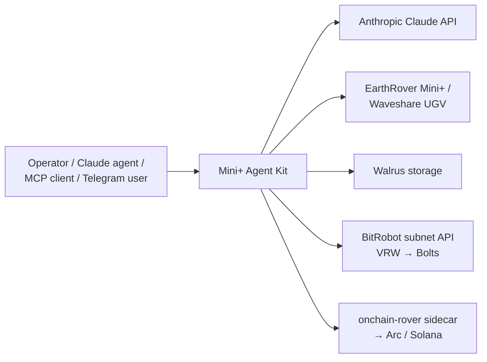
*Figure 1 — System context.*

---

## 3. Layered architecture

Front-ends depend only on the verb core (`make_tools` / `dispatch`); the core
depends on the `RoverVerbs` abstraction; each backend resolves to a transport and
a physical robot. `capture_work` branches into the work layer.

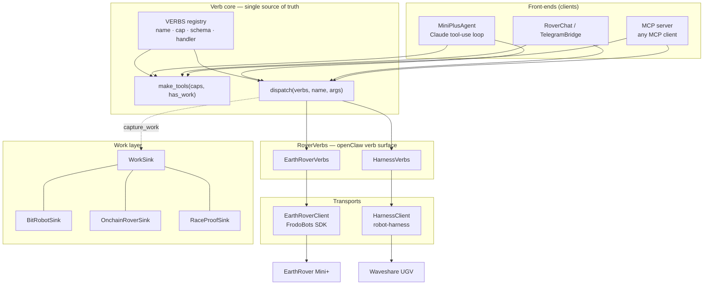
*Figure 2 — Layered architecture.*

---

## 4. The verb registry (single source of truth)

Each verb is a `Verb(name, cap, schema, run)` record. `make_tools(capabilities,
has_work)` filters the registry to the back-end's capabilities and emits Anthropic
tool schemas; `dispatch(name, args)` looks up the handler. The MCP server reuses
exactly these two functions, so the agent, the chat surface, and any MCP client
share **one** definition — adding a verb is a single registry entry.

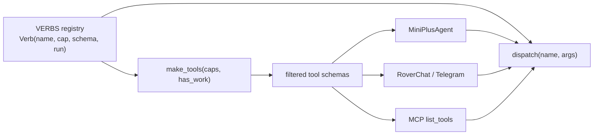
*Figure 3 — One registry derives every front-end's tools and the dispatcher.*

---

## 5. Control plane: the agent loop

The autonomous agent runs a manual tool-use loop on the Anthropic Messages API.
Vision flows back through `tool_result` blocks so the model always reasons over the
robot's current frame. The loop terminates on a `finish` verb or `end_turn`, and
the robot is stopped on exit.

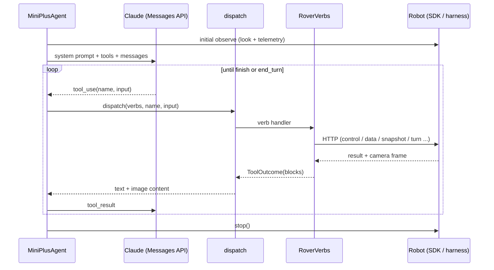
*Figure 4 — Agent control loop (the Telegram and MCP front-ends reuse `dispatch`).*

---

## 6. Robot abstraction and kinematics

Both back-ends present the same verb surface; only the wire protocol differs. The
EarthRover SDK accepts a unicycle **twist** `(linear, angular)`; the Waveshare
ESP32 accepts **differential** wheel speeds. The kit converts:

$$\text{left} = \text{linear} - \text{angular}, \qquad \text{right} = \text{linear} + \text{angular}$$

which is the exact inverse of the harness adapter's `diffToTwist`
($\text{linear}=\tfrac{l+r}{2},\ \text{angular}=\tfrac{r-l}{2}$).

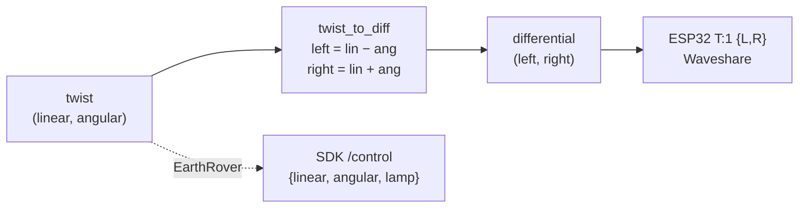
*Figure 5 — Twist↔differential; the EarthRover takes twist directly.*

### 6.1 Capability matrix

A front-end is offered a verb only if the active back-end advertises its
capability. `capture_work` additionally requires a configured `WorkSink`.

| Verb | EarthRover Mini+ | Waveshare UGV | Notes |
|---|:---:|:---:|---|
| `status_report` | ✓ | ✓ | real sensors, never fabricated |
| `look` | ✓ | ✓ | caption (Gemini optional) + frame |
| `photo` | ✓ | ✓ | JPEG bytes |
| `move` | ✓ | ✓ | distance-calibrated; aborts if lidar-blocked |
| `turn` | ✓ (server heading-feedback) | ✓ (client closed-loop yaw) | |
| `obstacle_check` | — | ✓ | lidar (UGV only) |
| `track_color` | ✓ (server VLA) | ✓ (client HSV servo, §8) | |
| `autonav` | ✓ | ✓ | built-in / lidar safe-forward |
| `navigate` | ✓ (GPS) | — | Urban-track waypoints (§7) |
| `checkpoint_reached` | ✓ | — | GPS missions |
| `speak` | ✓ | — | UGV has no TTS |
| `set_lamp` | ✓ (control lamp) | ✓ (ESP32 T:132) | |
| `camera_move` | — | ✓ (ESP32 T:133 gimbal) | |
| `capture_work` | ✓\* | ✓\* | \*requires a WorkSink |
| `finish` | ✓ | ✓ | always available |

---

## 7. GPS waypoint navigation (EarthRover Challenge — Urban track)

The Urban track is GPS-goal navigation with a **15 m** tolerance. Given the
rover's position $(\varphi_1,\lambda_1)$, heading $\psi$, and the next checkpoint
$(\varphi_2,\lambda_2)$, the kit computes (`geo.py`):

**Great-circle distance** ($R$ = mean Earth radius):
$$a=\sin^2\!\tfrac{\Delta\varphi}{2}+\cos\varphi_1\cos\varphi_2\sin^2\!\tfrac{\Delta\lambda}{2},\qquad d=2R\,\arcsin\sqrt{a}$$

**Initial bearing:**
$$\theta=\operatorname{atan2}\!\big(\sin\Delta\lambda\,\cos\varphi_2,\ \cos\varphi_1\sin\varphi_2-\sin\varphi_1\cos\varphi_2\cos\Delta\lambda\big)$$

**Signed heading error** (turn convention: $+$ = right), in $(-180°, 180°]$:
$$e=\big((\theta-\psi+540°)\bmod 360°\big)-180°$$

The `goto_checkpoint` controller turns to null $e$, then creeps forward, and
claims the checkpoint once $d \le 15\text{ m}$:

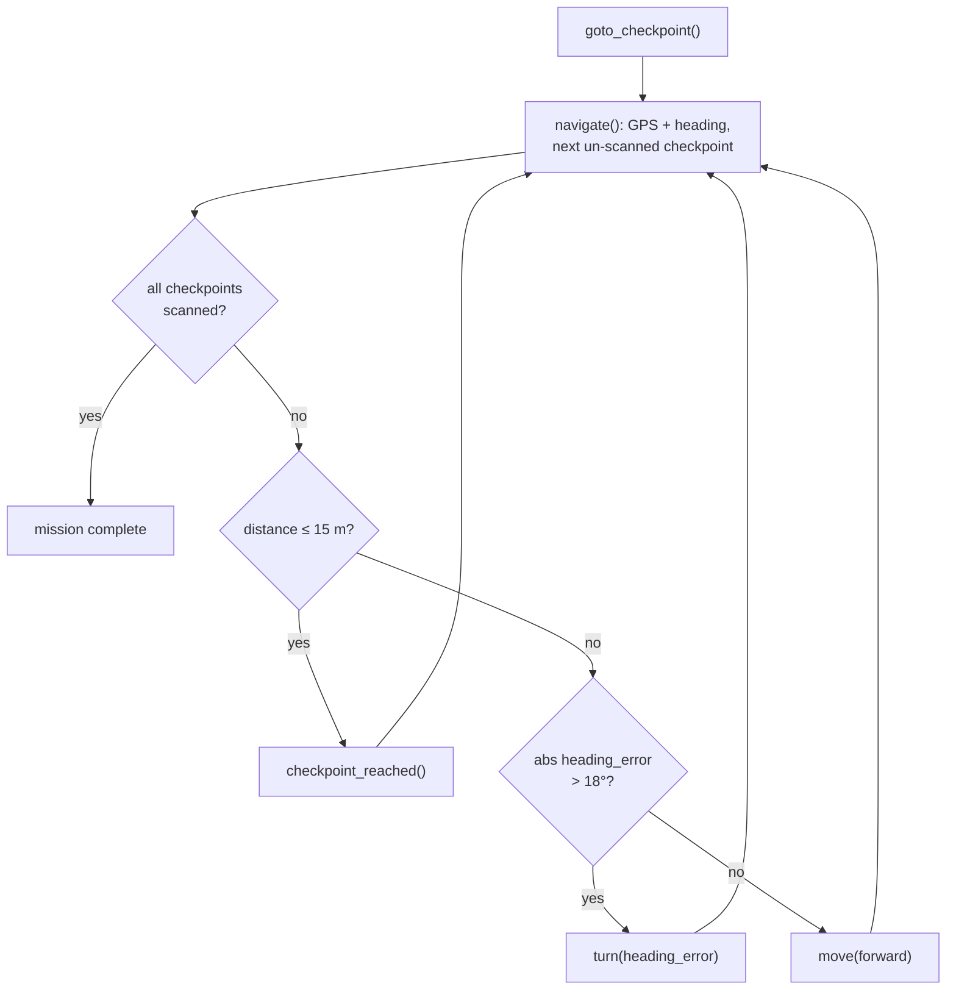
*Figure 6 — GPS waypoint controller. The LLM-agent variant instead calls
`navigate` for guidance and `look` to avoid obstacles GPS cannot see, then issues
`turn`/`move`/`checkpoint_reached` itself.*

The geometry is verified against the Berkeley→Stanford Marathon route
($d \approx 50$ km, $\theta \approx 171°$) and the controller is shown converging
to a checkpoint in a kinematic simulation over real HTTP (§13).

### 7.1 Closed-loop fused navigation (sensor fusion + pursuit + safety)

A real ground robot does not steer off raw 1 Hz GPS and a raw compass — those
signals are noisy enough to *fake* a checkpoint arrival. The kit therefore ships a
closed-loop **navigation stack** (`estimator.py` + `control.py`) wrapped by
`NavController` and driven by `goto_checkpoint_fused()` as the production autonomy
path; the bang-bang `goto_checkpoint` of §7 is retained as the baseline.

**Heading estimation.** A PI complementary filter fuses the fast-but-drifting gyro
with the slow-but-absolute magnetometer/orientation. A *plain* complementary filter
leaves a steady-state offset of $\approx b\,\Delta t/k_p$ under a constant gyro bias
$b$; an integral term learns and removes that bias online (Mahony-style):
$$\hat\psi \leftarrow \hat\psi + (\omega_z-\hat b)\,\Delta t,\qquad
  \hat\psi \leftarrow \hat\psi + k_p\,e_\psi,\qquad
  \hat b \leftarrow \hat b - k_i\,e_\psi\,\Delta t$$

**Pose estimation.** A 2-D position **Kalman filter** (not a fixed-gain pull):
dead-reckon local-ENU position from wheel odometry (or a commanded-velocity proxy
when none is exposed) along $\hat\psi$ while growing the covariance $P$ by the
process noise, then fuse each GPS fix by the *optimal* gain $K=P/(P+R)$ and shrink
$P$. The gain self-tunes — early/uncertain fixes count more — instead of a hand-set
$k_\text{gps}$. With process noise $q$ per metre and GPS variance $R=\sigma_\text{gps}^2$:
$$P \mathrel{+}= q\,|\Delta s|,\qquad
  K=\frac{P}{P+R},\qquad
  (x,y)\mathrel{+}=K\big((x_\text{gps},y_\text{gps})-(x,y)\big),\qquad
  P \leftarrow (1-K)\,P$$
Each fix is **Mahalanobis-gated**: $d^2=\lVert z-\hat x\rVert^2/(P+R)$; a fix with
$d^2>\chi^2_{2,0.99}\!\approx\!9.21$ (urban-canyon multipath) is rejected rather than
dragging the estimate off-line, with $P$ slightly inflated on repeated rejects to
re-acquire after a genuine relocation (anti-divergence).

**Pursuit control.** A single-target pure-pursuit reduction — curvature steering
plus approach slow-down — replaces turn-then-go bang-bang ($\alpha$ = signed bearing
error to the goal):
$$\omega=\operatorname{clamp}(-k_\text{ang}\sin\alpha,-1,1),\qquad
  u=v_\text{max}\,\max(0,\cos\alpha)\,\min(1,\,d/d_\text{slow})$$

**Safety envelope.** Every command is gated: battery floor, tilt cutoff
(ramp/pickup/stuck), and lidar time-to-collision $\text{TTC}=d_\text{front}/u$ —
hard-stop below `ttc_min`, linearly scale speed below `ttc_slow`.

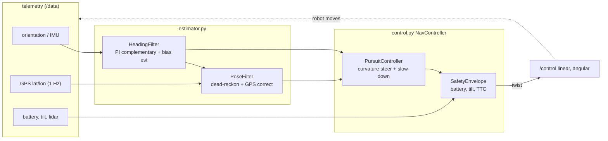
*Figure 6b — the fused closed loop. `NavController` composes the estimator, pursuit
controller, and safety envelope behind one `step(telemetry) → twist`.*

**Why it matters (validated A/B).** In a noisy kinematic simulation
(`tests/live/test_live_navstack.py`; GPS $\sigma=4$ m + periodic $+25$ m multipath
spikes, gyro bias $3°/\text{s}$, magnetometer $\sigma=8°$) the same truth and noise
sequence drive both controllers. The bang-bang baseline acts on raw GPS and a
multipath spike near the goal makes it **declare arrival 34.6 m from the checkpoint
— a missed checkpoint at the 15 m Urban-track tolerance**. The fused stack
**Mahalanobis-gates every injected multipath outlier**, tracks heading **2.2×
better than the raw magnetometer**, and **truly arrives within tolerance (14.9 m)**.

### 7.2 Global planning around obstacles (A* + regulated pure pursuit)

§7.1 still *seeks the waypoint in a straight line* — it drives into any building,
curb, or blocked sidewalk between the rover and the checkpoint. The standard fix
(ROS Nav2) splits navigation into a **global planner** that searches a path over a
costmap and a **local controller** that tracks it. The kit implements both
(`planner.py` + `control.RegulatedPurePursuit`), wired through
`EarthRoverVerbs.goto_checkpoint_planned(costmap)`.

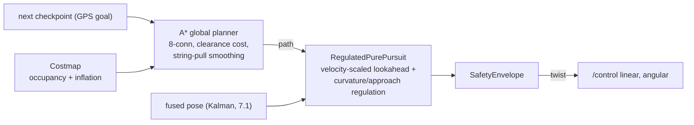
*Figure 6c — global planner → local tracker, the Nav2 split.*

**Global planner (`planner.py`).** A `Costmap` is an inflated occupancy grid in the
rover's local-ENU frame: obstacles are marked lethal and `inflate(r)` rings them
with a linearly-decaying cost so paths keep clearance. `plan_path` runs 8-connected
**A\*** with step cost $1+\text{cell\_cost}/50$ (it trades a little length for
clearance), forbids diagonal corner-cuts through lethal cells, and **string-pulls**
the staircase result to the minimal set of waypoints — where the smoothing chord
test respects the inflation layer (threshold $\tfrac{1}{2}\text{LETHAL}$), so it
keeps clearance instead of hugging the wall edge (which a corner-cutting tracker
would then clip).

**Local tracker (`RegulatedPurePursuit`).** Plain pure pursuit *"shows complete
failure with dramatic oscillations at 1.5 m/s"* [RPP]. The regulated variant
projects the robot onto the path, advances a **velocity-scaled lookahead**
$L=\operatorname{clamp}(t_\text{la}\,v,\,L_\text{min},\,L_\text{max})$ to a lookahead
point, steers by the pure-pursuit curvature $\kappa=2\sin\alpha/L$, then **regulates
speed**: down on sharp curvature (turn radius $r=1/|\kappa|<r_\text{min}$, scale
$r/r_\text{min}$) and on final-goal approach (scale $d/d_\text{approach}$) — then the
`SafetyEnvelope` (§7.1) gates the result.

**Why it matters (validated).** In `tests/live/test_live_planner.py` a building
straddles the straight line to the checkpoint. The naive straight-line seeker
**drives through the building for 46 ticks**; the planned route (A\* finds a 69 m
path vs the 60 m straight shot) is tracked with **zero obstacle incursions** and
reaches the goal. The costmap is *brought by the caller* — populated from the
platform's obstacle sense (camera-derived occupancy, a site map); the Earth Rover
SDK exposes only 1-D front lidar, so there the reactive `SafetyEnvelope` remains the
last line of defence and this is the framework for richer obstacle data.

### 7.3 Local obstacle avoidance: the Dynamic Window Approach

§7.2 routes around obstacles *known to the costmap*, and the `SafetyEnvelope` can
only **brake** on a surprise. Neither *steers around* an obstacle that appears at run
time — a pedestrian, a cone, a parked scooter. The **Dynamic Window Approach** (Fox,
Burgard & Thrun, 1997) is the standard local planner for exactly this; it searches
the space of immediately-executable velocities. Each cycle (`control.DWAPlanner`):

1. **Dynamic window** — restrict to $(v,\omega)$ reachable from the current command
   within one control period given acceleration limits.
2. **Rollout** — forward-simulate each candidate over a short horizon at constant
   $(v,\omega)$.
3. **Admissibility** — discard any trajectory whose clearance falls below the robot
   radius (a collision).
4. **Objective** — score the survivors by a normalized weighted sum and commit the
   best; the `SafetyEnvelope` still gates it:
$$G(v,\omega)=w_g\cdot\text{goal}+w_c\cdot\text{clearance}+w_s\cdot\text{speed}$$

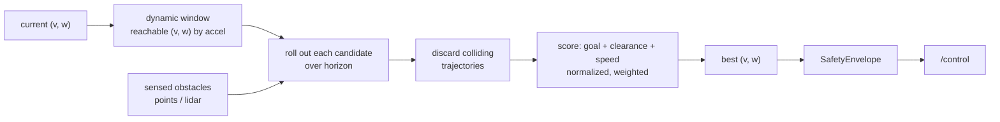
*Figure 6d — the dynamic-window local planner.*

**Why it matters (validated).** In `tests/live/test_live_dwa.py` a pedestrian walks
across the corridor to intercept the rover on the checkpoint approach. Plain pursuit
(no avoidance) closes to **0.16 m — a collision**; the DWA planner holds **2.87 m
clearance** and still reaches the goal. Wired into `NavController(use_dwa=True)` with
an `obstacles` list, it is the reactive avoidance layer beneath the global plan —
together giving the Nav2 trio: global A\* path, regulated-pursuit tracking, and
dynamic-window local avoidance.

### 7.4 Estimator refinements: course fusion, mag calibration, full covariance

Three production-grade refinements harden the estimator against real sensor
pathologies:

**(a) Speed-gated GPS-course fusion (`HeadingFilter`).** A magnetometer suffers local
magnetic disturbance (a steel railing, the rover's own motors); GPS
*course-over-ground* is magnetically immune and drift-free, but undefined at rest and
noise-dominated at low speed (unreliable below ~1 km/h). The filter fuses course as a
second absolute — gated and ramped by speed — and, when course is confident,
**down-weights the magnetometer** (it may be the disturbed source). Course is derived
*only* from Kalman-accepted fixes (so multipath never feeds heading) and only when the
inter-fix displacement clears the GPS noise (else position-differenced course is noise,
not signal — real receivers use Doppler velocity). Validated
(`tests/live/test_live_heading.py`): under a 25° hard-iron magnetometer bias, course
fusion cuts heading RMSE **24.9° → 10.4° (2.4×)**.

**(b) Magnetometer hard/soft-iron calibration (`MagnetometerCalibrator`).** Raw
readings trace an off-centre ellipsoid, not a sphere — hard-iron shifts the centre,
soft-iron scales the axes. Min/max calibration over a yaw rotation recovers the offset
$b_i=(\max_i+\min_i)/2$ and diagonal scale $s_i=\bar r/r_i$; calibrated
$m_i'=s_i\,(m_i-b_i)$. Validated: on a synthetic ellipsoid (offset + 1.6/0.7 axis
scale) calibration cuts heading RMSE **>5×, to under 2°**.

**(c) Full 2×2 covariance + GPS latency (`PoseFilter`).** The pose filter carries the
complete covariance $P=\begin{pmatrix}p_{xx}&p_{xy}\\p_{xy}&p_{yy}\end{pmatrix}$ and
grows it with **anisotropic** process noise — more uncertainty *along* the heading than
across it (wheel slip/scale error accumulate along travel) — so the Mahalanobis gate
$d^2=\nu^\top S^{-1}\nu$ uses the true innovation covariance. A delayed fix (telemetry
latency) is fused against the pose it actually describes — rewound ``age_steps`` in a
short displacement buffer — not the current pose.

These complete the estimator; remaining hardening (full off-diagonal soft-iron via
ellipsoid least-squares, Doppler-velocity course, per-fix timestamping) needs
on-hardware data to tune and validate.

---

## 8. Visual servoing: `track_color`

The flagship "find and follow the coloured card" demo. On the Waveshare it is a
client-side loop (no server VLA): decode the JPEG, threshold in HSV, take the
blob centroid $x_f\in[0,1]$ and area fraction $A$, then steer proportionally.

With error $e = x_f - \tfrac{1}{2}$, gain $k_p$, base speed $v$:
$$\omega=\operatorname{clamp}(-k_p\,e,\,-1,\,1),\qquad u=v\big(1-\min(0.8,\,1.5|e|)\big)$$
Arrival when $A \ge A_\text{stop}$ (default $0.12$).

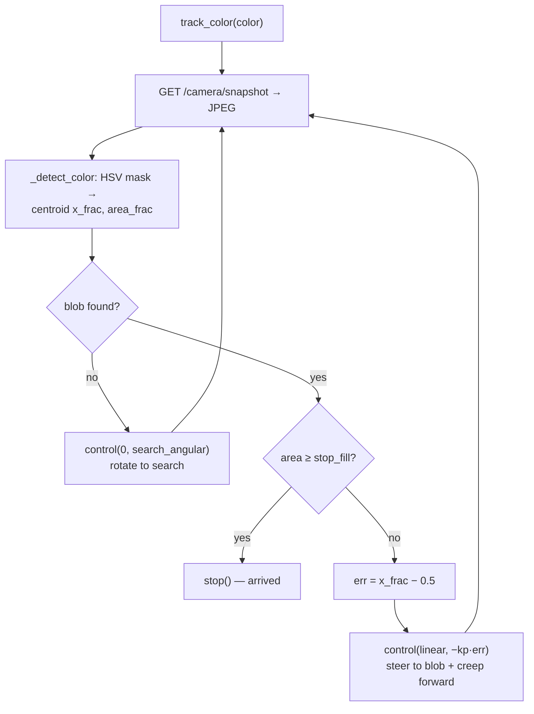
*Figure 7 — `track_color` visual-servo loop (validated on generated frames, §13).*

---

## 9. Verifiable Robotic Work (on-chain data)

A run produces an **artifact**: the camera frame is stored once on Walrus and
content-addressed (sha256 + IPFS CIDv1). The same artifact fans out to one or more
ledgers behind `MultiSink`.

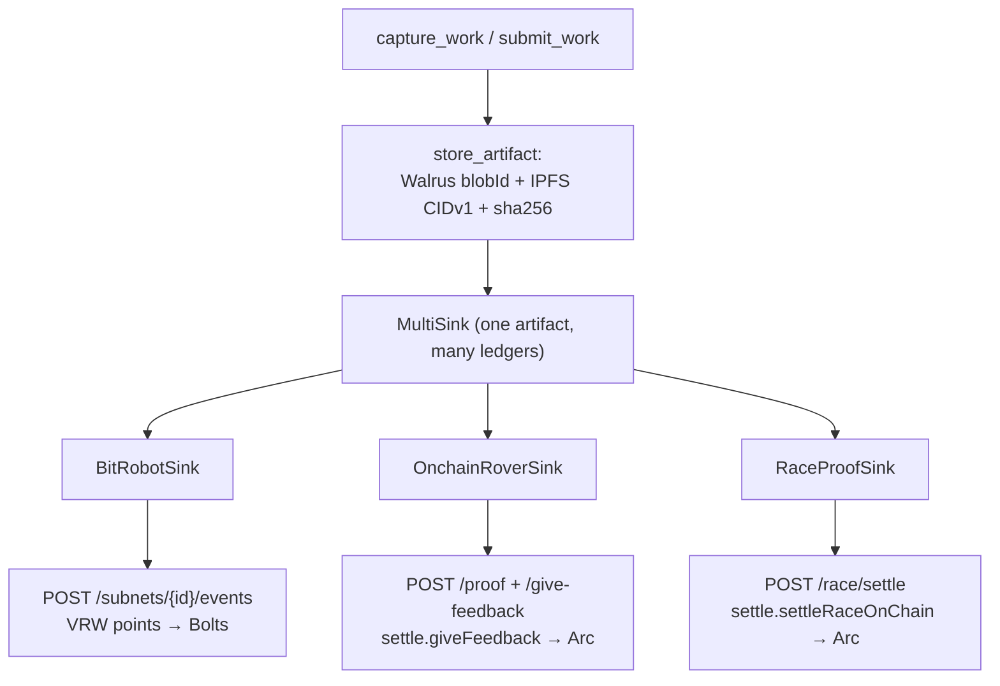
*Figure 8 — One content-addressed artifact, multiple ledgers.*

The canonical BitRobot path is a four-event lifecycle culminating in network-wide
Bolts:

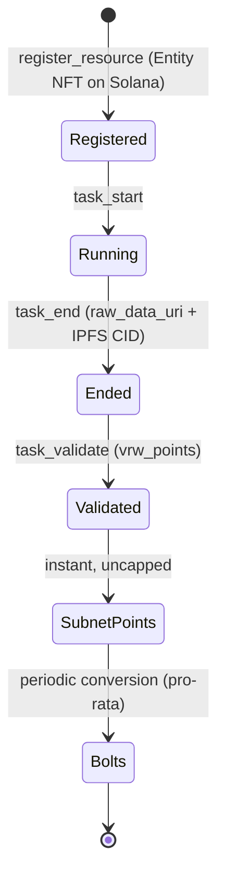
*Figure 9 — BitRobot Verifiable Robotic Work lifecycle.*

| Sink | Endpoint(s) | Anchor |
|---|---|---|
| `BitRobotSink` | `POST /subnets/{id}/events` | Subnet Points → Bolts; resource = Entity NFT (Solana) |
| `OnchainRoverSink` | `POST /proof`, `POST /give-feedback` | `settle.giveFeedback` → `ReputationRegistry` (Arc) |
| `RaceProofSink` | `POST /race/settle` | `settle.settleRaceOnChain` → `RaceMarket` (Arc) |

`raw_data_uri` is the public Walrus URL; `raw_data_cid` is computed in-process
(`cid_v1_raw` for ≤ 1 MiB, the `ipfs` CLI for larger). sha256 is sent as bare hex
to `giveFeedback`/`settleRaceOnChain` (they re-add the `0x`).

---

## 10. Waveshare command stack

The kit talks HTTP to the Rust `robot-harness`, which owns the serial link and
emits the authoritative ESP32 JSON commands (verified against
`waveshareteam/ugv_base_general`; see `WAVESHARE_PROTOCOL.md`).

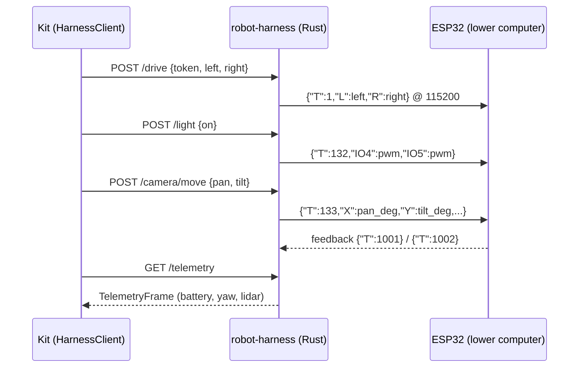
*Figure 10 — Host → harness → ESP32 command stack (pan ∈ [−180,180], tilt ∈ [−30,90]).*

---

## 11. Module dependency graph

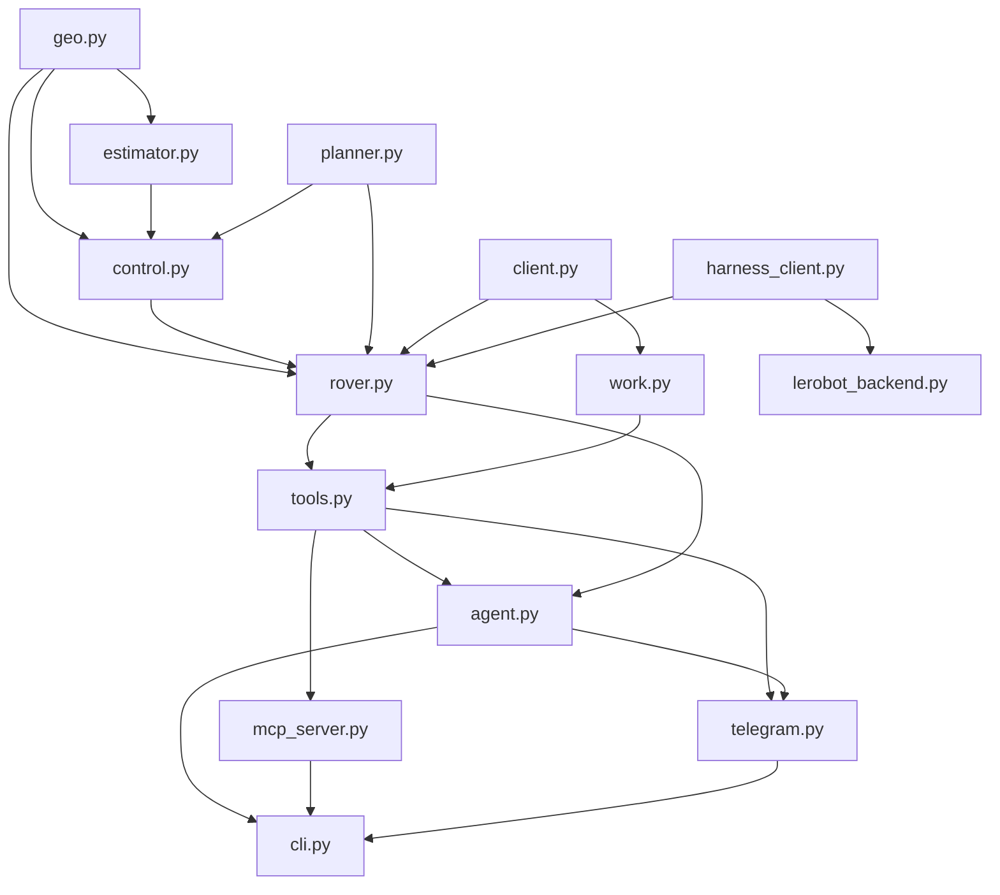
*Figure 11 — Internal module dependencies (acyclic; `tools.py` is the hub).*

---

## 12. End-to-end scenario

A complete Urban-track checkpoint with on-chain settlement:

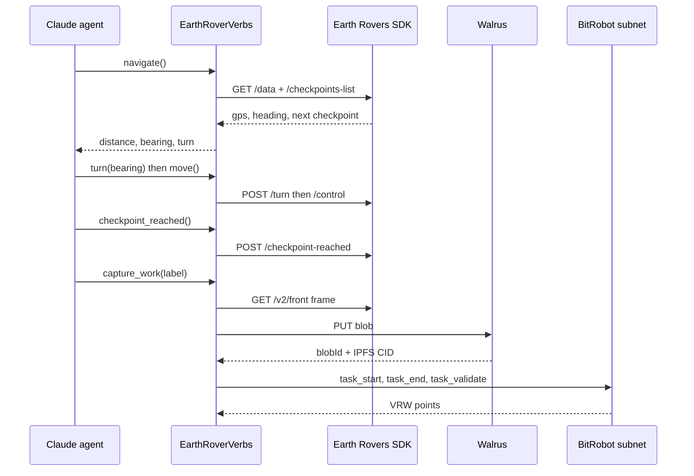
*Figure 12 — Reach a GPS checkpoint, then post Verifiable Robotic Work.*

---

## 13. Verification

Two suites. The **hermetic** suite stubs `httpx`/`anthropic` for fast,
dependency-free, deterministic coverage. The **live** suite uses real libraries
and real I/O (a local HTTP server emulates the harness; Walrus is a public
testnet) — no robot or keys required.

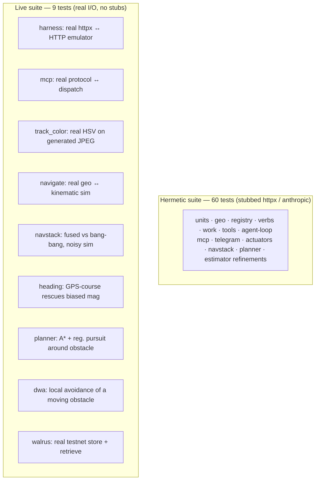
*Figure 13 — Test topology.*

| Live test | What is exercised for real |
|---|---|
| harness | real `httpx` round-trip; twist→`0.4/0.4` on the wire; telemetry/lidar parse; JPEG bytes; closed-loop turn; `/light`; `/camera/move` mapping |
| mcp | real MCP `initialize → list_tools → call_tool` → `dispatch` → HTTP; `ImageContent` |
| track_color | real HSV detection + servo on real generated JPEGs (right-blob → turn-right; arrival stop) |
| navigate | real geo + the `goto_checkpoint` controller converging to a checkpoint (65 m → 9 m) in a 2-D kinematic sim |
| navstack | fused `NavController` (Kalman pose filter + Mahalanobis gating) vs bang-bang baseline on the same noisy truth incl. GPS multipath: baseline false-arrives 34.6 m out; fused gates every outlier, arrives truly (14.9 m), heading 2.2× better than raw mag |
| heading | speed-gated GPS-course fusion vs mag-only `HeadingFilter` under a 25° hard-iron bias: course fusion cuts heading RMSE 24.9° → 10.4° (2.4×) |
| planner | A\* over an inflated costmap + regulated pure pursuit vs straight-line seeking: naive drives through a building (46 ticks inside); planned route (69 m vs 60 m straight) reaches the goal with 0 incursions |
| dwa | Dynamic Window Approach vs plain pursuit with a *moving* pedestrian: pursuit closes to 0.16 m (collision); DWA holds 2.87 m clearance and still reaches the goal |
| walrus | real testnet store + byte-identical retrieve + IPFS CIDv1 |

> **Scope of validation.** The plumbing, protocols, content-addressing, geometry,
> and the perception/control loops are exercised against real I/O or a simulator.
> On-hardware control-gain tuning, the Rust harness compile (`libudev-dev`), and
> keyed services (live Anthropic / FrodoBots SDK / BitRobot subnet / on-chain
> `giveFeedback`) remain validated against their documented contracts, not a live
> deployment.

---

## 14. Mapping to the Earth Rover Challenge

The kit is a drop-in **off-board policy** for the EarthRover Challenge: it speaks
the Remote Access SDK, accepts the live camera + GPS, and outputs directional
commands. The Urban track maps to `navigate` + `move`/`turn` + `checkpoint_reached`
(§7); the same harness supports a deterministic controller *and* a vision-aware
LLM-agent baseline. Difficulty × completion-time scoring is a property of the
mission; the kit provides the policy.

## References

- LeRobot — EarthRover Mini+ integration (HuggingFace).
- Earth Rovers SDK — `frodobots-org/earth-rovers-sdk` (openClaw branch).
- BitRobot subnet API — `docs.bitrobot.ai`.
- Earth Rover Challenge — `earth-rover-challenge.github.io` (IROS 2026).
- Waveshare ESP32 firmware — `waveshareteam/ugv_base_general` (see `WAVESHARE_PROTOCOL.md`).
- Mahony PI complementary attitude filter — `ahrs.readthedocs.io/en/latest/filters/mahony.html` (heading + gyro-bias, §7.1).
- `robot_localization` dual-EKF + navsat_transform — ROS GPS/IMU/odometry fusion (§7.1 Kalman pose, §7.4 course fusion).
- Magnetometer hard/soft-iron calibration (min/max & ellipsoid-fit methods) (§7.4).
- [RPP] Macenski et al., *Regulated Pure Pursuit for Robot Path Tracking*, arXiv:2305.20026; Nav2 `regulated_pure_pursuit` (§7.2).
- [DWA] Fox, Burgard & Thrun, *The Dynamic Window Approach to Collision Avoidance*, IEEE R&A 1997 (§7.3).
