# Mini+ Agent Kit — System Architecture

> A reference architecture for driving a BitRobot-compatible ground robot (a
> FrodoBots **EarthRover Mini+** or a **Waveshare UGV**) with a large language
> model, and for converting its runs into on-chain **Verifiable Robotic Work**.
> All figures are Mermaid (render natively on GitHub) and were syntax-validated.

---

## Abstract

This document specifies the architecture of the Mini+ Agent Kit. The kit is
organised so that **one declarative description of the robot's verbs** drives
three interchangeable front-ends — an autonomous Claude agent, a Telegram chat
surface, and a Model Context Protocol (MCP) server — over **two interchangeable
robot back-ends**, and emits a single content-addressed work artifact to **one or
more on-chain ledgers**. The design deliberately conforms to three existing
specifications rather than inventing glue: the **LeRobot** robot interface, the
**openClaw** verb surface, and the **BitRobot** subnet (Verifiable Robotic Work)
API. We give the component model, the control-plane protocol, the kinematics and
GPS-navigation control laws (the EarthRover Challenge Urban track), the visual
servoing law (`track_color`), and the data-commitment pipeline, each with a
validated figure.

---

## 1. Design principles

1. **Single source of truth.** Every verb is declared once (name, capability,
   JSON schema, handler). The Anthropic tool schemas, the MCP tool list, and the
   dispatch table are all *derived* from that registry (§4).
2. **Conform, don't reinvent.** Robot ↔ LeRobot; agent ↔ openClaw verbs;
   on-chain work ↔ BitRobot VRW. Standard interfaces give ecosystem
   interoperability (datasets, MCP clients, subnet rewards) for free.
3. **Capability gating.** Each back-end advertises a capability set; a front-end
   is only ever offered the verbs its current robot can perform (§6).
4. **Fan-out at the edges, one core.** Many front-ends and many ledgers, but a
   single verb core and a single content-addressed artifact.

---

## 2. System context

The kit sits between a controller (a human, the Claude agent, an MCP client, or a
Telegram user) and the external services it integrates.

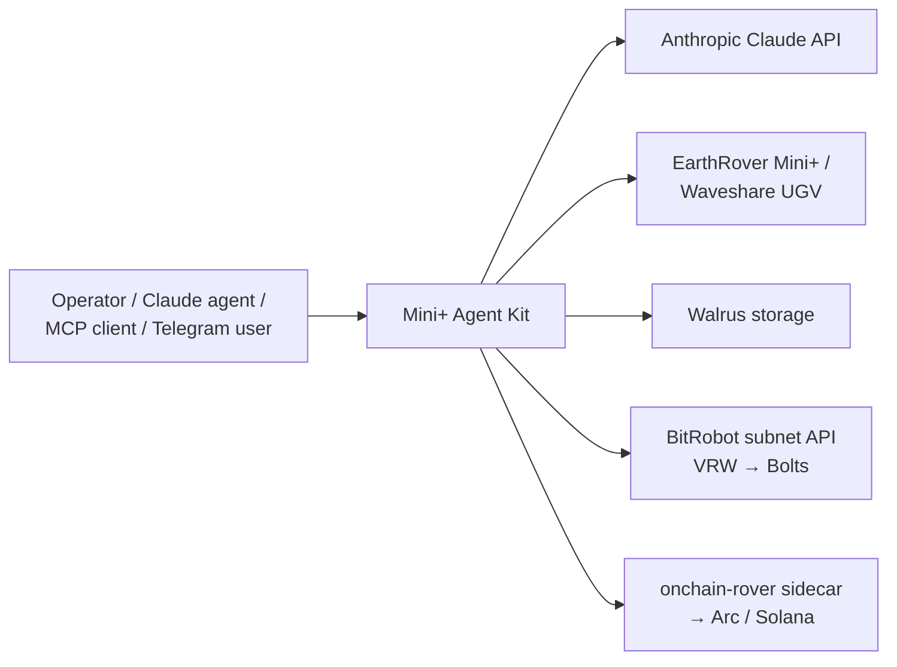
*Figure 1 — System context.*

---

## 3. Layered architecture

Front-ends depend only on the verb core (`make_tools` / `dispatch`); the core
depends on the `RoverVerbs` abstraction; each backend resolves to a transport and
a physical robot. `capture_work` branches into the work layer.

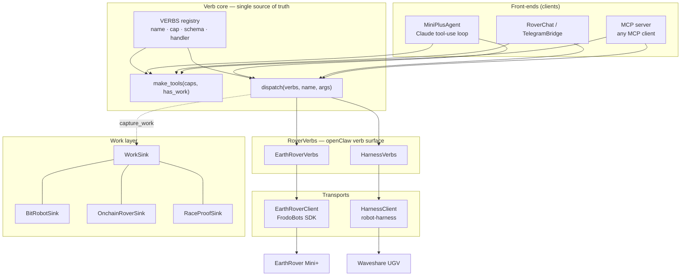
*Figure 2 — Layered architecture.*

---

## 4. The verb registry (single source of truth)

Each verb is a `Verb(name, cap, schema, run)` record. `make_tools(capabilities,
has_work)` filters the registry to the back-end's capabilities and emits Anthropic
tool schemas; `dispatch(name, args)` looks up the handler. The MCP server reuses
exactly these two functions, so the agent, the chat surface, and any MCP client
share **one** definition — adding a verb is a single registry entry.

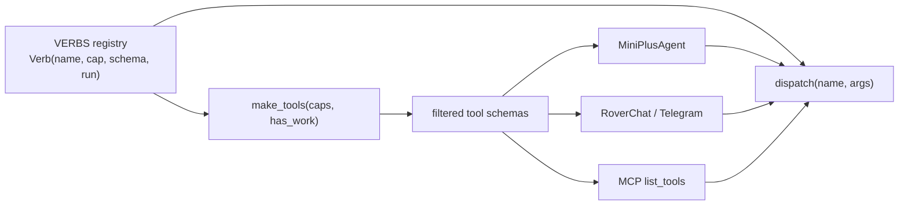
*Figure 3 — One registry derives every front-end's tools and the dispatcher.*

---

## 5. Control plane: the agent loop

The autonomous agent runs a manual tool-use loop on the Anthropic Messages API.
Vision flows back through `tool_result` blocks so the model always reasons over the
robot's current frame. The loop terminates on a `finish` verb or `end_turn`, and
the robot is stopped on exit.

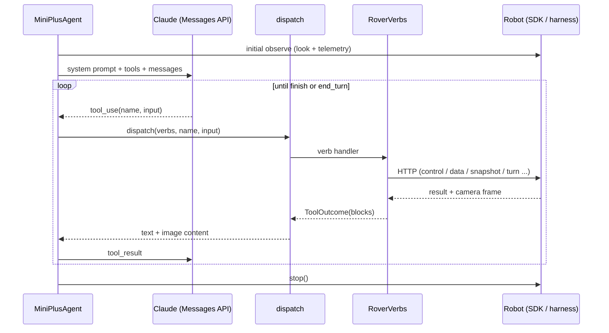
*Figure 4 — Agent control loop (the Telegram and MCP front-ends reuse `dispatch`).*

---

## 6. Robot abstraction and kinematics

Both back-ends present the same verb surface; only the wire protocol differs. The
EarthRover SDK accepts a unicycle **twist** `(linear, angular)`; the Waveshare
ESP32 accepts **differential** wheel speeds. The kit converts:

$$\text{left} = \text{linear} - \text{angular}, \qquad \text{right} = \text{linear} + \text{angular}$$

which is the exact inverse of the harness adapter's `diffToTwist`
($\text{linear}=\tfrac{l+r}{2},\ \text{angular}=\tfrac{r-l}{2}$).

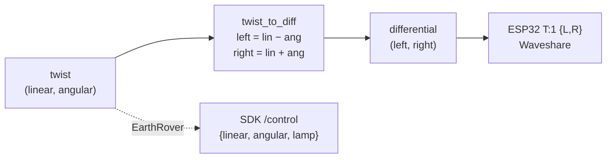
*Figure 5 — Twist↔differential; the EarthRover takes twist directly.*

### 6.1 Capability matrix

A front-end is offered a verb only if the active back-end advertises its
capability. `capture_work` additionally requires a configured `WorkSink`.

| Verb | EarthRover Mini+ | Waveshare UGV | Notes |
|---|:---:|:---:|---|
| `status_report` | ✓ | ✓ | real sensors, never fabricated |
| `look` | ✓ | ✓ | caption (Gemini optional) + frame |
| `photo` | ✓ | ✓ | JPEG bytes |
| `move` | ✓ | ✓ | distance-calibrated; aborts if lidar-blocked |
| `turn` | ✓ (server heading-feedback) | ✓ (client closed-loop yaw) | |
| `obstacle_check` | — | ✓ | lidar (UGV only) |
| `track_color` | ✓ (server VLA) | ✓ (client HSV servo, §8) | |
| `autonav` | ✓ | ✓ | built-in / lidar safe-forward |
| `navigate` | ✓ (GPS) | — | Urban-track waypoints (§7) |
| `checkpoint_reached` | ✓ | — | GPS missions |
| `speak` | ✓ | — | UGV has no TTS |
| `set_lamp` | ✓ (control lamp) | ✓ (ESP32 T:132) | |
| `camera_move` | — | ✓ (ESP32 T:133 gimbal) | |
| `capture_work` | ✓\* | ✓\* | \*requires a WorkSink |
| `finish` | ✓ | ✓ | always available |

---

## 7. GPS waypoint navigation (EarthRover Challenge — Urban track)

The Urban track is GPS-goal navigation with a **15 m** tolerance. Given the
rover's position $(\varphi_1,\lambda_1)$, heading $\psi$, and the next checkpoint
$(\varphi_2,\lambda_2)$, the kit computes (`geo.py`):

**Great-circle distance** ($R$ = mean Earth radius):
$$a=\sin^2\!\tfrac{\Delta\varphi}{2}+\cos\varphi_1\cos\varphi_2\sin^2\!\tfrac{\Delta\lambda}{2},\qquad d=2R\,\arcsin\sqrt{a}$$

**Initial bearing:**
$$\theta=\operatorname{atan2}\!\big(\sin\Delta\lambda\,\cos\varphi_2,\ \cos\varphi_1\sin\varphi_2-\sin\varphi_1\cos\varphi_2\cos\Delta\lambda\big)$$

**Signed heading error** (turn convention: $+$ = right), in $(-180°, 180°]$:
$$e=\big((\theta-\psi+540°)\bmod 360°\big)-180°$$

The `goto_checkpoint` controller turns to null $e$, then creeps forward, and
claims the checkpoint once $d \le 15\text{ m}$:

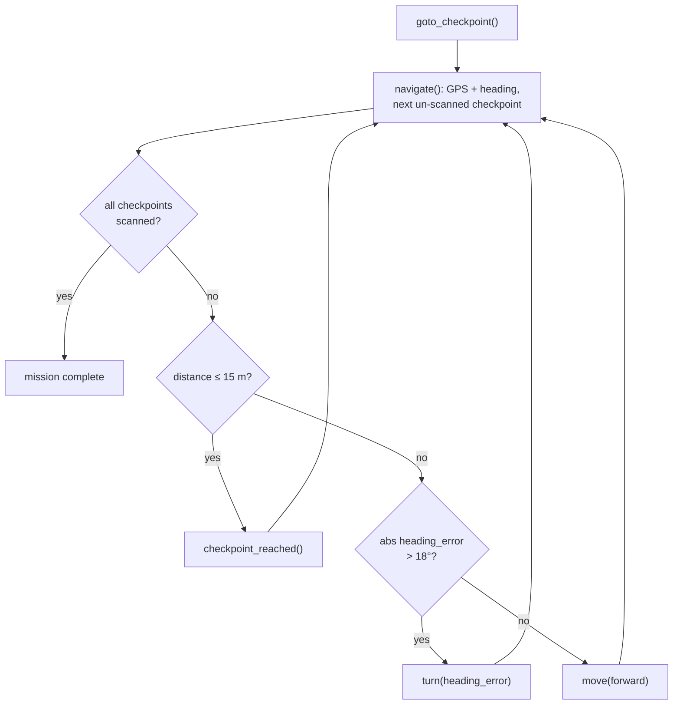
*Figure 6 — GPS waypoint controller. The LLM-agent variant instead calls
`navigate` for guidance and `look` to avoid obstacles GPS cannot see, then issues
`turn`/`move`/`checkpoint_reached` itself.*

The geometry is verified against the Berkeley→Stanford Marathon route
($d \approx 50$ km, $\theta \approx 171°$) and the controller is shown converging
to a checkpoint in a kinematic simulation over real HTTP (§13).

---

## 8. Visual servoing: `track_color`

The flagship "find and follow the coloured card" demo. On the Waveshare it is a
client-side loop (no server VLA): decode the JPEG, threshold in HSV, take the
blob centroid $x_f\in[0,1]$ and area fraction $A$, then steer proportionally.

With error $e = x_f - \tfrac{1}{2}$, gain $k_p$, base speed $v$:
$$\omega=\operatorname{clamp}(-k_p\,e,\,-1,\,1),\qquad u=v\big(1-\min(0.8,\,1.5|e|)\big)$$
Arrival when $A \ge A_\text{stop}$ (default $0.12$).

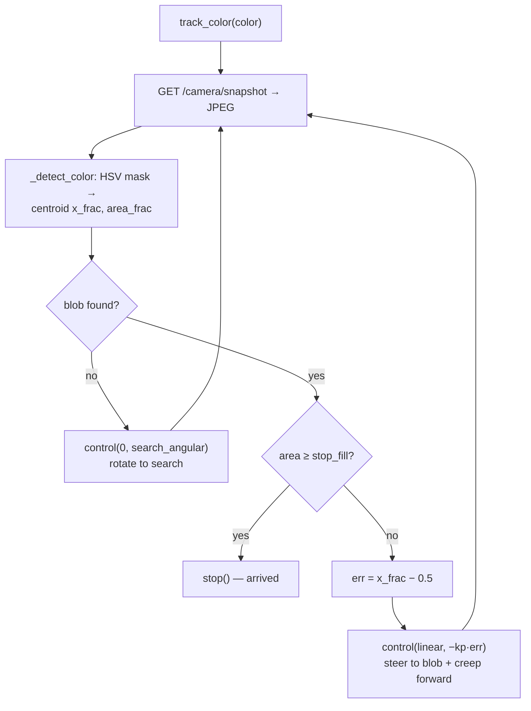
*Figure 7 — `track_color` visual-servo loop (validated on generated frames, §13).*

---

## 9. Verifiable Robotic Work (on-chain data)

A run produces an **artifact**: the camera frame is stored once on Walrus and
content-addressed (sha256 + IPFS CIDv1). The same artifact fans out to one or more
ledgers behind `MultiSink`.

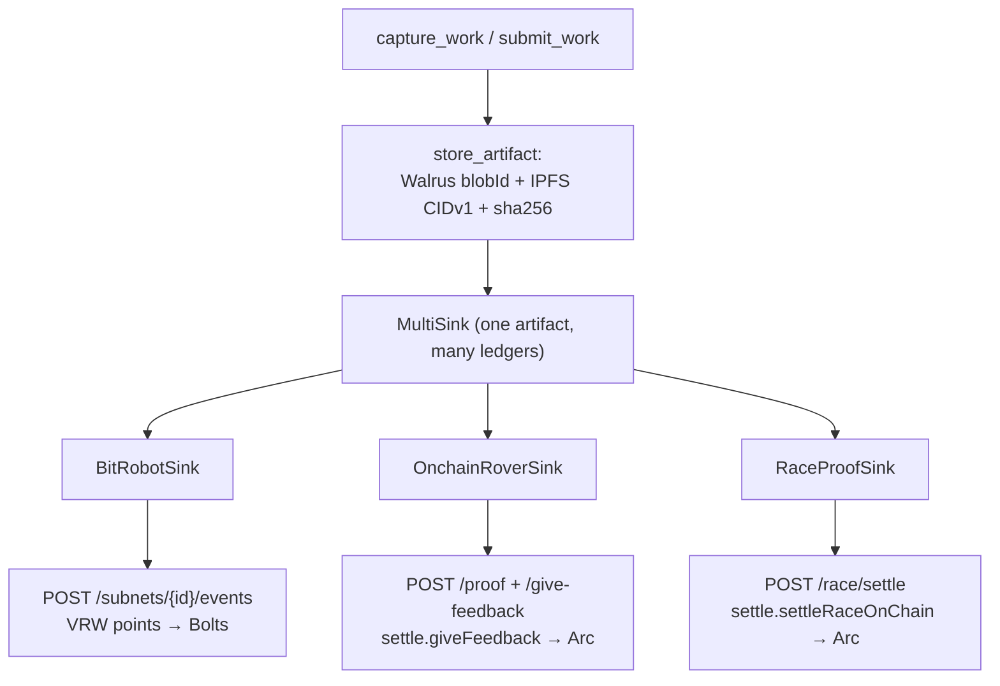
*Figure 8 — One content-addressed artifact, multiple ledgers.*

The canonical BitRobot path is a four-event lifecycle culminating in network-wide
Bolts:

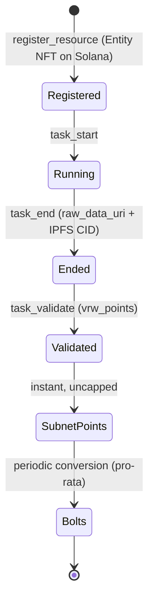
*Figure 9 — BitRobot Verifiable Robotic Work lifecycle.*

| Sink | Endpoint(s) | Anchor |
|---|---|---|
| `BitRobotSink` | `POST /subnets/{id}/events` | Subnet Points → Bolts; resource = Entity NFT (Solana) |
| `OnchainRoverSink` | `POST /proof`, `POST /give-feedback` | `settle.giveFeedback` → `ReputationRegistry` (Arc) |
| `RaceProofSink` | `POST /race/settle` | `settle.settleRaceOnChain` → `RaceMarket` (Arc) |

`raw_data_uri` is the public Walrus URL; `raw_data_cid` is computed in-process
(`cid_v1_raw` for ≤ 1 MiB, the `ipfs` CLI for larger). sha256 is sent as bare hex
to `giveFeedback`/`settleRaceOnChain` (they re-add the `0x`).

---

## 10. Waveshare command stack

The kit talks HTTP to the Rust `robot-harness`, which owns the serial link and
emits the authoritative ESP32 JSON commands (verified against
`waveshareteam/ugv_base_general`; see `WAVESHARE_PROTOCOL.md`).

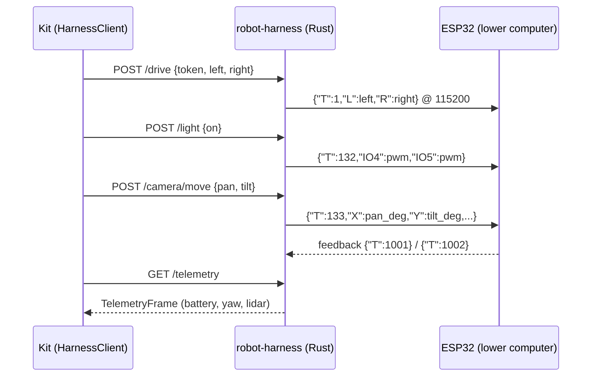
*Figure 10 — Host → harness → ESP32 command stack (pan ∈ [−180,180], tilt ∈ [−30,90]).*

---

## 11. Module dependency graph

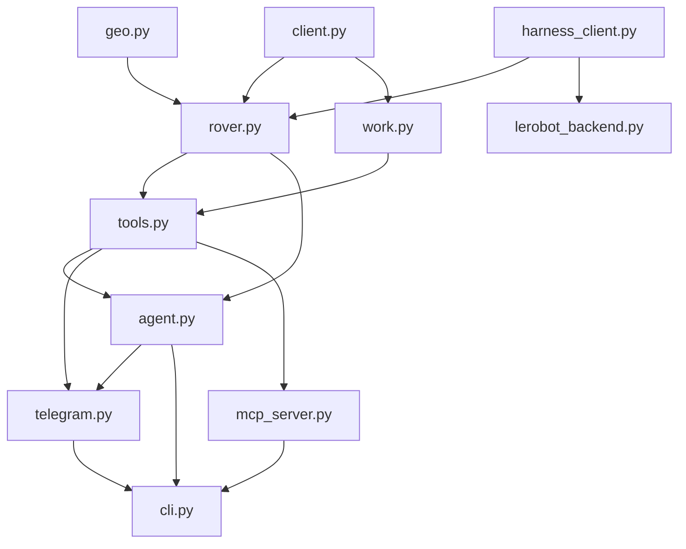
*Figure 11 — Internal module dependencies (acyclic; `tools.py` is the hub).*

---

## 12. End-to-end scenario

A complete Urban-track checkpoint with on-chain settlement:

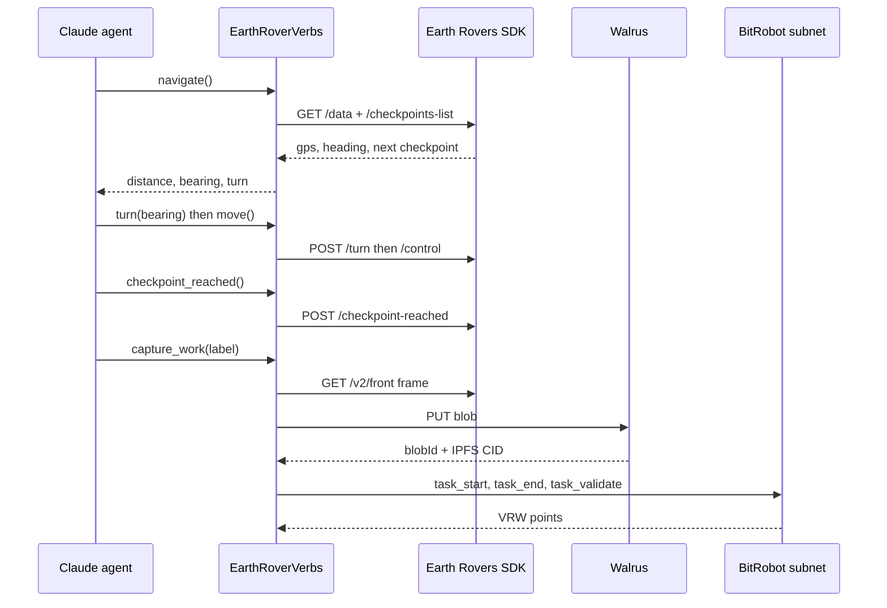
*Figure 12 — Reach a GPS checkpoint, then post Verifiable Robotic Work.*

---

## 13. Verification

Two suites. The **hermetic** suite stubs `httpx`/`anthropic` for fast,
dependency-free, deterministic coverage. The **live** suite uses real libraries
and real I/O (a local HTTP server emulates the harness; Walrus is a public
testnet) — no robot or keys required.

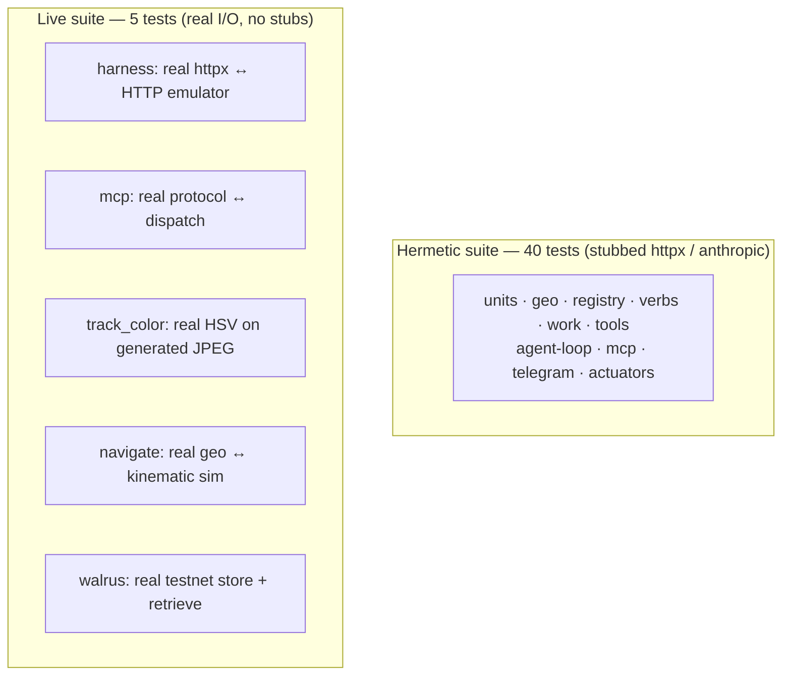
*Figure 13 — Test topology.*

| Live test | What is exercised for real |
|---|---|
| harness | real `httpx` round-trip; twist→`0.4/0.4` on the wire; telemetry/lidar parse; JPEG bytes; closed-loop turn; `/light`; `/camera/move` mapping |
| mcp | real MCP `initialize → list_tools → call_tool` → `dispatch` → HTTP; `ImageContent` |
| track_color | real HSV detection + servo on real generated JPEGs (right-blob → turn-right; arrival stop) |
| navigate | real geo + the `goto_checkpoint` controller converging to a checkpoint (65 m → 9 m) in a 2-D kinematic sim |
| walrus | real testnet store + byte-identical retrieve + IPFS CIDv1 |

> **Scope of validation.** The plumbing, protocols, content-addressing, geometry,
> and the perception/control loops are exercised against real I/O or a simulator.
> On-hardware control-gain tuning, the Rust harness compile (`libudev-dev`), and
> keyed services (live Anthropic / FrodoBots SDK / BitRobot subnet / on-chain
> `giveFeedback`) remain validated against their documented contracts, not a live
> deployment.

---

## 14. Mapping to the Earth Rover Challenge

The kit is a drop-in **off-board policy** for the EarthRover Challenge: it speaks
the Remote Access SDK, accepts the live camera + GPS, and outputs directional
commands. The Urban track maps to `navigate` + `move`/`turn` + `checkpoint_reached`
(§7); the same harness supports a deterministic controller *and* a vision-aware
LLM-agent baseline. Difficulty × completion-time scoring is a property of the
mission; the kit provides the policy.

## References

- LeRobot — EarthRover Mini+ integration (HuggingFace).
- Earth Rovers SDK — `frodobots-org/earth-rovers-sdk` (openClaw branch).
- BitRobot subnet API — `docs.bitrobot.ai`.
- Earth Rover Challenge — `earth-rover-challenge.github.io` (IROS 2026).
- Waveshare ESP32 firmware — `waveshareteam/ugv_base_general` (see `WAVESHARE_PROTOCOL.md`).
